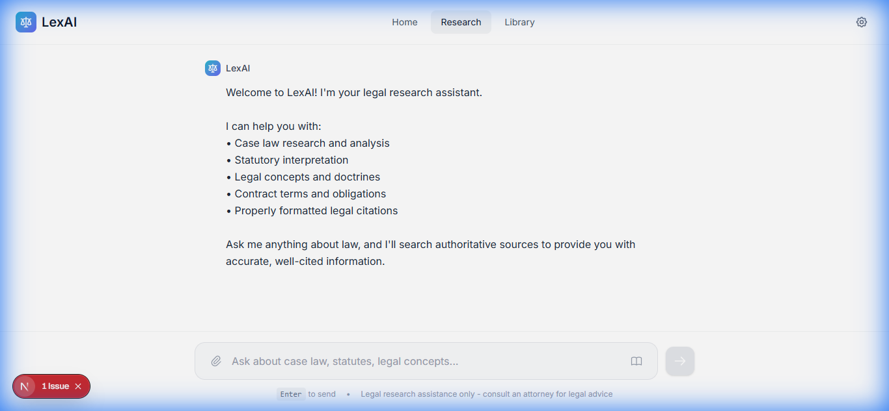
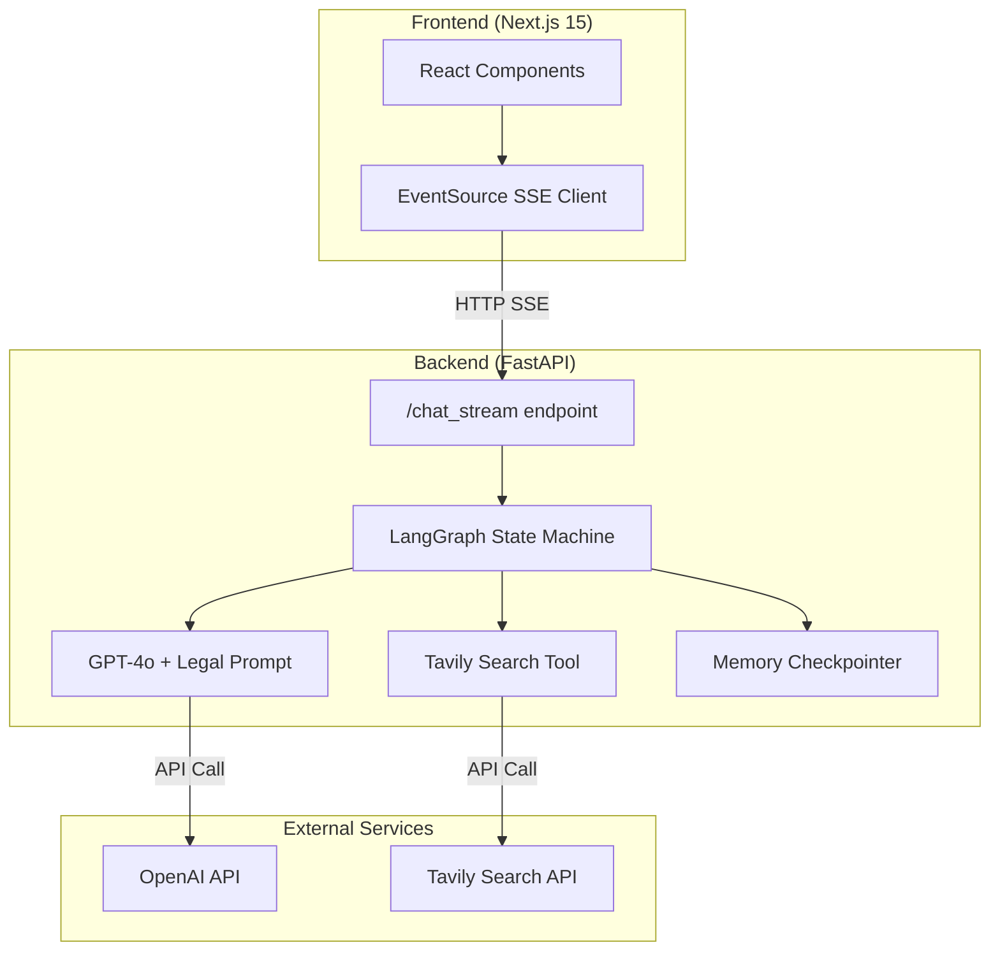

# LexAI - Legal Research Assistant

An AI-powered legal research chatbot built with Next.js and LangGraph, featuring a Perplexity-style interface for comprehensive legal analysis and research.



## Features

- 🔍 **Legal Research** - Search case law, statutes, and legal commentary
- ⚖️ **Expert Analysis** - IRAC/CREAC structured responses with proper citations
- 🌐 **Web Search Integration** - Tavily search for current legal developments
- 💬 **Conversational Memory** - Maintains context across the conversation
- 🎨 **Perplexity-Style UI** - Clean, modern interface with source cards

---

## System Architecture



### Data Flow

1. User enters legal question in the UI
2. Frontend sends request via Server-Sent Events (SSE)
3. LangGraph orchestrates the conversation flow:
   - Sends query to GPT-4o with legal research system prompt
   - GPT-4o may invoke Tavily search for current information
   - Responses stream back to client in real-time
4. UI displays search progress and formatted response

---

## Tech Stack

| Layer | Technology |
|-------|------------|
| Frontend | Next.js 15, React 19, Tailwind CSS 4 |
| Backend | FastAPI, LangGraph, LangChain |
| LLM | OpenAI GPT-4o |
| Search | Tavily Search API |
| State | LangGraph MemorySaver (checkpoints) |

---

## Project Structure

```
legal-chatbot/
├── client/                 # Next.js frontend
│   ├── src/
│   │   ├── app/
│   │   │   ├── layout.tsx  # Root layout with fonts
│   │   │   ├── page.tsx    # Main chat page
│   │   │   └── globals.css # Perplexity-style theme
│   │   └── components/
│   │       ├── Header.tsx      # Navigation header
│   │       ├── InputBar.tsx    # Search input
│   │       └── MessageArea.tsx # Chat messages
│   └── package.json
│
├── server/                 # FastAPI backend
│   ├── app.py             # Main application with LangGraph
│   ├── requirements.txt   # Python dependencies
│   └── Dockerfile         # Container config
│
└── README.md
```

---

## Setup & Installation

### Prerequisites

- Node.js 18+
- Python 3.10+
- OpenAI API key
- Tavily API key

### Environment Variables

Create `.env` in the `server/` directory:

```env
OPENAI_API_KEY=your_openai_api_key
TAVILY_API_KEY=your_tavily_api_key
```

### Backend Setup

```bash
cd server
pip install -r requirements.txt
uvicorn app:app --reload --port 8000
```

### Frontend Setup

```bash
cd client
npm install
npm run dev
```

Open http://localhost:3000

---

## Deployment

### Docker Deployment (Backend)

```bash
cd server
docker build -t lexai-backend .
docker run -p 8000:8000 --env-file .env lexai-backend
```

### Vercel Deployment (Frontend)

1. Push code to GitHub
2. Connect repository to Vercel
3. Set environment variable:
   ```
   NEXT_PUBLIC_API_URL=https://your-backend-url.com
   ```
4. Deploy

### Production Checklist

- [ ] Set CORS origins to production domains in `app.py`
- [ ] Configure persistent storage for checkpoints (Redis/PostgreSQL)
- [ ] Add rate limiting and authentication
- [ ] Set up monitoring and logging
- [ ] Configure HTTPS for both frontend and backend

---

## API Reference

### `GET /chat_stream/{message}`

Stream a chat response for the given message.

**Query Parameters:**
- `checkpoint_id` (optional): Continue an existing conversation

**Response (SSE):**
```json
{"type": "checkpoint", "checkpoint_id": "uuid"}
{"type": "search_start", "query": "search query"}
{"type": "search_results", "urls": ["url1", "url2"]}
{"type": "content", "content": "streamed text"}
{"type": "end"}
```

---

## Legal Disclaimer

⚠️ **LexAI provides legal research assistance only.** The information provided is for educational purposes and does not constitute legal advice. Always consult a licensed attorney for specific legal matters.

---

## License

MIT License - See LICENSE file for details.
